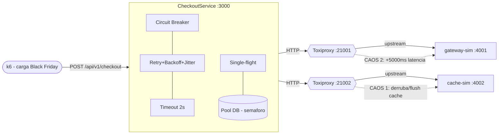

# Fase 4 — Engenharia do Caos e Testes de Desempenho (SRE)

**Componente:** `CheckoutService` — EntregasJá S.A.
**Ferramentas:** k6 (carga/estresse) · Toxiproxy (injeção de falhas) · Node.js 22
**Vale:** 2,5 pts — *Configuração realista do k6, thresholds de SLO, cenário de Thundering Herd e prova de Degradação Graciosa com cálculo de MTTR.*

> Esta fase tira o isolamento do código (testado nas Fases 2 e 3) e submete o
> sistema **inteiro** a condições extremas, provando que a arquitetura
> sobrevive ao caos: latência limitada, sem exaustão de threads e com
> recuperação automática.

---

## 1. Visão geral

O experimento sobe 3 processos Node e injeta caos na **rede** entre eles usando
o Toxiproxy, enquanto o k6 gera a volumetria da Black Friday.



O Toxiproxy fica **no meio** das conexões TCP, então conseguimos degradar a
rede de verdade (latência, queda) sem mexer no código da aplicação.

---

## 2. Camada de resiliência (por que o sistema sobrevive)

Implementada em `src/resilience/` e orquestrada em `src/services/CheckoutService.js`.
Cada mecanismo ataca um modo de falha específico:

| Mecanismo | Arquivo | Requisito | Para que serve no caos |
|---|---|---|---|
| **Timeout 2s** por tentativa | `resilience/timeout.js` | RN04 | Aborta o socket lento (Gateway Lento) e libera o event loop — evita exaustão de threads |
| **Retry 3x + Backoff 500ms + Jitter** | `resilience/retry.js` | RN05/RN06 | Recupera soluços de rede; o jitter espalha as retentativas e evita a manada bater junto |
| **Circuit Breaker** (abre > 50% erro) | `resilience/CircuitBreaker.js` | RN07 | Quando a dependência cai, passa a **falhar rápido (~ms)** em vez de esperar 4×2s — é o coração da degradação graciosa |
| **Single-flight** | `resilience/singleflight.js` | — | Coalesce a manada (10k req) em **1 query** por chave → protege o banco no Thundering Herd |
| **Pool limitado (semáforo)** | `resilience/Semaphore.js` | — | Simula o pool de conexões: o banco **nunca** recebe mais que `DB_MAX_CONCURRENCY` chamadas simultâneas |
| **E-mail assíncrono** (fire-and-forget) | `services/CheckoutService.js` | RF02 | A latência do SMTP não entra no tempo de resposta do checkout |
| **Fallback limpo** | `services/CheckoutService.js` | RF05/RN07 | Esgotou/breaker aberto → `ERRO_GATEWAY` controlado, sem *uncaught exception* |

Ordem de composição (de fora para dentro):
`retry( circuitBreaker( timeout( gateway.cobrar ) ) )`.
O `CircuitOpenError` é **não-retentável** (não adianta retentar com o disjuntor
aberto), o que garante a falha rápida.

---

## 3. SLI / SLO (thresholds)

Espelham a Seção 5 do DER (`docs/especificacao.md`). Configurados nos scripts k6
(`load/lib/config.js`) e aplicáveis via `-e SLO_P95_MS=... -e SLO_ERROR_RATE=...`.

| SLI | SLO (meta) | Threshold k6 |
|---|---|---|
| Latência p95 do `/api/v1/checkout` | **< 2500 ms** | `http_req_duration: p(95)<2500` |
| Taxa de erro (requisições) | **< 5%** | `http_req_failed: rate<0.05` |
| Taxa de sucesso de checks | > 95% | `checks: rate>0.95` |
| Disponibilidade do processo (caos) | > 99% respondeu | `disponibilidade: rate>0.99` |

> **Nuance honesta de SRE:** durante uma **queda total** do gateway, a taxa de
> erro **vai** estourar 5% (não há como aprovar pagamento sem o banco). O que
> prova a degradação graciosa nesse caso é a **latência continuar baixa** e o
> **processo continuar de pé** (disponibilidade ~100%), porque o breaker corta
> as chamadas. Discutimos isso na análise (Seção 7).

---

## 4. Pré-requisitos e instalação (Windows)

Node já validado (v22). Faltam o k6 e o Toxiproxy:

```powershell
# k6 (escolha uma)
winget install k6 --source winget
# ou: choco install k6
# ou baixe o .exe: https://github.com/grafana/k6/releases

# Toxiproxy (server + cli) — baixe os .exe das releases:
#   https://github.com/Shopify/toxiproxy/releases
#   toxiproxy-server-windows-amd64.exe  e  toxiproxy-cli-windows-amd64.exe
# Coloque-os no PATH (ou na pasta do projeto).
```

Verifique:

```powershell
k6 version
toxiproxy-server --version
```

Instale as dependências do projeto:

```powershell
npm install
```

---

## 5. Runbook de execução

Use **vários terminais** do PowerShell (recomendado dividir a tela para o vídeo).

### 5.1. Baseline (sem caos)

```powershell
# Terminal A — sobe gateway-sim + cache-sim + app
npm run stack

# Terminal B — fumaça e carga base
npm run k6:smoke
npm run k6:bf
```

Esperado: smoke 100% 200; black-friday com `http_req_duration p95 < 2500ms` e
`http_req_failed < 5%` **PASS**.

### 5.2. Modo caos (com Toxiproxy)

```powershell
# Terminal A — Toxiproxy server
toxiproxy-server

# Terminal B — sobe gateway-sim + cache-sim + APP apontando p/ os proxies
npm run stack:chaos

# Terminal C — cria os proxies (gateway:21001, cache:21002)
npm run chaos:setup
```

---

## 6. Cenário 1 — Thundering Herd (Manada Estourada)

**Objetivo:** com ~10.000 requisições simultâneas, derrubar o nó de cache de
repente e provar que **o banco sobrevive** (single-flight + backoff/jitter + pool).

```powershell
# Terminal C — grava a linha do tempo das métricas internas
npm run monitor

# Terminal B — carga massiva (ajuste a escala ao seu hardware)
k6 run load/thundering-herd.js
#   para se aproximar de 10k simultâneas:
#   k6 run -e PEAK_RPS=5000 -e MAX_VUS=10000 load/thundering-herd.js

# Terminal D — NO PICO da carga, dispare o caos (flush + derruba cache 15s)
npm run chaos:herd
```

**O que observar / evidências (em `GET /internal/metrics` e no CSV do monitor):**

- `repository.pool.peak` **≤ `DB_MAX_CONCURRENCY`** (ex: ≤ 20) → o banco **nunca**
  foi além do pool, mesmo com a manada.
- `configProvider.singleFlight.coalesced` **>> 0** → milhares de leituras foram
  coalescidas em poucas queries (`configProvider.dbLoads` pequeno).
- `checkout_sucesso > 95%` no k6 mesmo com o cache fora → manada absorvida.
- Sem `uncaught exception` no log do app.

**Print/recorte para o vídeo:** a tabela do `npm run monitor` mostrando
`db_peak` estável enquanto `sf_coalesced` dispara no instante do flush.

### Evidência real coletada neste projeto

Plano B sem k6 (`scripts/burst.js`, útil para reproduzir rápido): 2000
requisições com 200 conexões simultâneas, **cache derrubado** no início:

```
Status: { '200': 2000 }                         <- 100% de sucesso (banco sobreviveu)
Latencia ms -> avg=636 p50=544 p95=1365 max=1741  <- p95 1365ms < SLO 2500ms
DB pool.peak (max=20): 20 | rejeitadas_pool=0   <- nunca passou do pool
single-flight coalesced: 118 | config dbLoads: 5 <- manada coalescida
breaker: state=CLOSED                            <- gateway saudavel
```

> Para reproduzir: `npm run stack` → flush do cache
> (`Invoke-RestMethod http://127.0.0.1:4002/admin/flush -Method Post`) →
> `node scripts/burst.js 2000 200`. Em produção/avaliação use o k6
> (`load/thundering-herd.js`), que escala melhor para ~10k conexões.

---

## 7. Cenário 2 — Gateway Lento (prova de Degradação Graciosa)

**Objetivo:** injetar +5000ms na API de pagamento e provar que o app **não trava**
— o breaker abre e passa a falhar rápido, mantendo a latência sob controle.

```powershell
# Terminal C — grava a linha do tempo
npm run monitor

# Terminal B — carga constante
k6 run load/gateway-lento.js

# Terminal D — após ~15s, injeta 5s de latência por 30s e depois remove
npm run chaos:gateway-latency 30
```

### Evidência real coletada neste projeto (plano B, via `gateway-sim /admin/mode`)

Sequência de requisições com o gateway a ~5,3s de resposta e timeout de 2s:

```
req 1  -> HTTP 500  em 9918ms   <- breaker CLOSED, tenta 1+3x (timeout 2s) -> lento
req 2  -> HTTP 500  em 2591ms   <- janela de erro cruza 50% -> breaker ABRE
req 3  -> HTTP 500  em 20ms     <- breaker OPEN -> FALHA RÁPIDA
req 4  -> HTTP 500  em 15ms
...                              (todas ~15-30ms, em vez de ~9,5s)
req 15 -> HTTP 500  em 15ms
```

Após remover a latência e aguardar o `resetTimeout` (3s):

```
req 1 -> HTTP 200 (PROCESSADO) em 329ms   <- HALF_OPEN: chamada de teste passa -> CLOSED
req 2 -> HTTP 200 (PROCESSADO) em 322ms   <- recuperado
req 3 -> HTTP 200 (PROCESSADO) em 318ms
breaker: { state: CLOSED, opens: 1, shortCircuited: 14, success: 4, failure: 9 }
```

**Leitura:** sem o breaker, **toda** requisição esperaria ~9,5s (1+3 tentativas
de 2s + backoff) e o pool de conexões/threads esgotaria → colapso (5xx em massa
e `status 0` no k6). Com o breaker, após ~2 requisições o sistema passa a
responder em **~20ms** (degradação graciosa) e se **recupera sozinho** quando a
falha some.

---

## 8. Cálculo do MTTR (Mean Time To Recovery)

Definimos **MTTR = tempo entre o fim da falha e a normalização do serviço**
(breaker volta a `CLOSED` **e** as requisições voltam a `200` dentro do SLO).

**Como medir (reproduzível):**

1. O script de caos imprime o timestamp do **fim da falha**
   (`...DESLIGADO ... (inicio do MTTR)` / `cache ONLINE novamente ...`).
2. No CSV gerado por `npm run monitor` (`load/results/metrics-*.csv`), ache a
   **primeira linha** após esse instante em que `breaker_state = CLOSED` e
   `proc` (PROCESSADO) volta a subir.
3. `MTTR = t_recuperação − t_fim_da_falha`.

**Exemplo com os números reais acima (Gateway Lento):**

- Fim da falha: latência removida em `t = 0s`.
- O breaker estava `OPEN` com `resetTimeout = 3000ms`; a 1ª requisição após esse
  intervalo entrou em `HALF_OPEN`, teve sucesso (329ms) e fechou o disjuntor.
- **MTTR ≈ 3,0s + ~0,3s ≈ 3,3s** (dominado pelo `BREAKER_RESET_TIMEOUT_MS`).

> O MTTR é, por construção, **previsível e configurável** via
> `BREAKER_RESET_TIMEOUT_MS`. Trade-off: valores menores recuperam mais rápido,
> porém testam a dependência com mais frequência enquanto ela ainda pode estar
> instável.

---

## 9. Antes × Depois (legado × resiliente)

| Aspecto | Legado (`CheckoutService.legacy.js`) | Resiliente (`CheckoutService.js`) |
|---|---|---|
| Gateway lento (5s) | Cada req trava ~5s → exaustão de threads | Timeout 2s + breaker → falha em ~20ms |
| Falha transitória | Vira `ERRO_GATEWAY` na hora | Retry 3x + backoff/jitter recupera |
| Dependência caída | Continua martelando | Breaker abre, falha rápido, auto-recupera |
| Cache derrubado | Manada bate direto no banco | Single-flight coalesce → 1 query |
| E-mail | Síncrono, soma na latência | Assíncrono, não bloqueia resposta |
| Falha de banco | Exceção pode derrubar o processo | Fallback limpo, processo de pé |

Mostre os dois lado a lado no vídeo para evidenciar o ganho arquitetural.

---

## 10. Mapa com a rubrica da Fase 4

| Item exigido | Onde está |
|---|---|
| Configuração realista do k6 (ramp-up/steady/ramp-down) | `load/black-friday.js` |
| Thresholds de SLO corretos | `load/lib/config.js` + thresholds em cada script |
| Cenário de Thundering Herd | `load/thundering-herd.js` + `infra/toxiproxy/chaos-thundering-herd.js` |
| Injeção de falha (Toxiproxy) | `infra/toxiproxy/*` (latência + queda) |
| Prova de Degradação Graciosa | Seção 7 + circuit breaker + `/internal/metrics` |
| Cálculo de MTTR | Seção 8 + `scripts/record-metrics.js` |

---

## 11. Checklist para o vídeo (8–12 min)

- [ ] Tela dividida: k6 gerando carga + Toxiproxy injetando o caos.
- [ ] Mostrar o **exato momento** da injeção (latência / queda do cache).
- [ ] Apontar no `npm run monitor` o breaker indo `CLOSED → OPEN → CLOSED`.
- [ ] Destacar p95 e taxa de erro vs. os SLOs (mantidos ou violados, e por quê).
- [ ] Mostrar `repository.pool.peak ≤ pool` no Thundering Herd (banco sobreviveu).
- [ ] Calcular o MTTR a partir dos timestamps.
- [ ] Comparar legado × resiliente.
